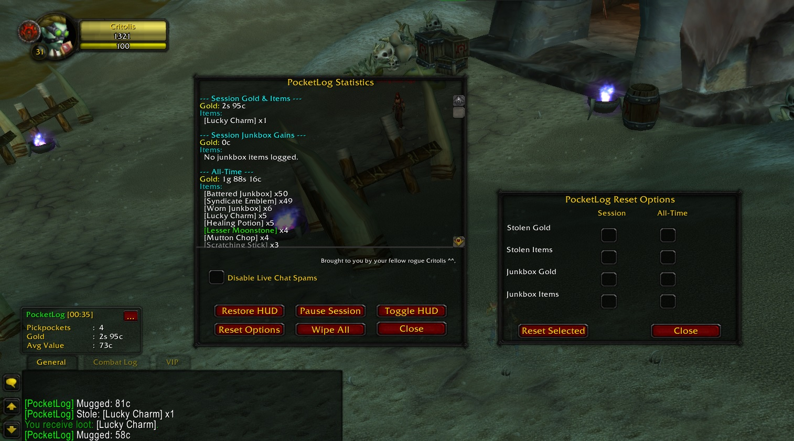

# PocketLog

PocketLog is a lightweight Classic (1.12) addon that collects pickpocket/junkbox loot into a dedicated UI panel to avoid chat spam and present session/all-time summaries.

Installation
- Drop the `PocketLog` folder into your `Interface/AddOns/` directory.
- In-game, run `/reload` to load the addon.

Quick Commands
- `/pocket` — Open the detailed PocketLog window. Shows session gold, session items, junkbox gains, and all-time totals. Use the buttons at the bottom to Restore HUD, open Reset Options, Toggle HUD, or Wipe Everything.
- `/pocketreset` — Open the Reset Options window (also available from the pocket window). Select the checkboxes for Session or All-Time resets and click "Reset Selected" to apply.

Live HUD & Quiet Mode
- The HUD shows live session stats (mobs mugged, liberated coins, gold/hr). Use the "Toggle HUD" button or the Restore HUD button to control it.
- Use the "Disable Live Chat Spams" checkbox to suppress chat messages for every pickup — useful to keep chat clean while still logging to the UI.

Notes
- This addon targets Classic WoW (1.12) compatibility and uses built-in UI templates.

Credits
Brought to you by your fellow rogue Critolis
